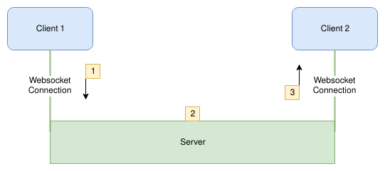
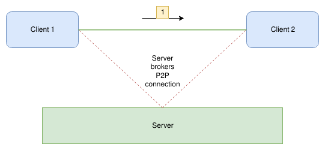

# Real Time Apps: Websockets and WebRTC
### A comprehensive look at updating applications in real time

When the web exploded into popularity, it generally consisted of one thing: static HTML pages. This didn't last long however, and the Internet has grown far beyond its roots. As websites have gotten progressively more dynamic, so have user expectations for interactive pages.

However, dynamic websites pose a problem. Webpages are primarily requested by, then loaded to, a browser using the Hypertext Transfer Protocol (HTTP). That being said, HTTP is fundamentally useless for real time updating because the protocol relies on reloading the entire page for every new request.

To avoid cumbersome reloading when requesting or delivering new data, a solution was required that allowed for a continous connection, allowing data to be transfered on a whim. Such a protocol would fill in the massive gap in HTTP, which only works via a cycle of request, response, refresh page, repeat.

## Real Time Updating: Websockets

Websockets are a protocol frequently used by applications for open, two way communication between a client and a server. The typical connection process is as follows:

- The server creates a listener to wait upon connection events on a specific port
- The client makes a connection to the server's open port
- The server recognizes a new connection and assigns the client to a virtual 'socket'. This allows it to keep track of each connected client.

Once this connection has been established, the server and client are free to share data in a bidirectional manner. To reiterate, unlike traditional HTTP where communication is formed as a sequential request -> response, websocket connections allow data to flow freely.

This type of data transfer is incredibly useful because it allows clients to update with new data without making a request, consequently refreshing their entire state. This allows for a fluid, dynamic user interface, as well as a more optimized exchange between server and client.

Not only does the client now have real time communication with the server, but it also has real time communication with all other clients connected to a socket on that server. This means than any action a user has on the state of a web app is reflected almost instantly to all other users viewing the same app.

The above diagram shows how effective a websocket server can be for hosting live-data apps. Real time stock monitoring, instant messaging, games, etc. are all achievable with sockets.

However, as awesome as websockets sound, they do have limitations. While they excel at sending individual packets of data in succession, they are not quite as proficent at continous streaming, ie. audio and video. Thus, another protocol is needed to satisfy the use case: Web Real Time Commnunication (webRTC).

## A Comparison of Function

At first glance, it may be difficult to discern the difference between webRTC and websockets. They both allow for bidirectional free data flow, and are commonly used for apps that must update small pieces of state frequently. 

WebRTC however, achieves this through a much different connection scheme than its counterpart. 

Have a look at the following diagram:

Notice that whereas websockets route data *through* a server, a webRTC connection is peer to peer. The server acts only as a signaler; it manages call requests to broker a connection between clients, but doesn't involve itself in the actual transfer of data.

This provides several benefits over the use of websockets:

- Lower latency: With a more direct route, the total time for data transfer from client 1 to client 2 is lessened.
- Privacy insurance: Users can feel safe about where there data is being sent, as there is no chance for data to be skimmed from the connection by the signaling server.
- Fewer potential points of failure: One connection is less vulnerable than two, simple as that.

## Which, When?

Does this mean that websockets are obsolete? Should webRTC be the sole standard for real time communication?

Definetly not.

Frankly, webRTC is overkill for most real time use cases. It doesn't really shine until you need to have a continuous, robust stream of continuous data that does not need to be logged or reccorded; primarily audio/video calls, or multiplayer games. 

For more mundane tasks, such as sending messages between clients, updating a client-side UX to be concurrent with details from a database, or cases where logging is useful, stick to a regular websocket.

Websockets and webRTC do not compete with one another; rather, they are compliments. Tools to be used in specific situations. 

Signaling servers, for example, are best implemented with a harmony of websockets and webRTC. The server-client relationship begins with the a socket connection, and on demand, the server proceeds to foster a peer-to-peer connection between two or more connected clients. Websockets are ideal for signaling servers because it provides the server a persistent reference to active users and thus makes routing the peer-to-peer connections trivial.

## The Future to Come

It is never a sure game when 'predicting' the future of tech and software, but one can say with reasonable certainty that websockets and webRTC have a growing use case. The web, in its short life, has evolved remarkebly quickly and humans as a society have grown ever dependent on vast pools of accessible, up-to-date information. I think it highly likely that webRTC will continue to gain popularity, expanding the boundaries of what is possible in web development.